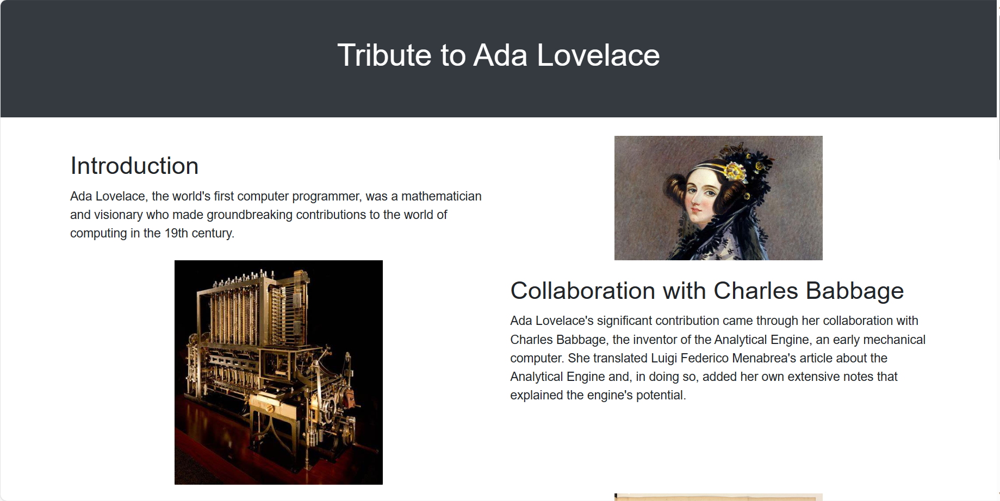
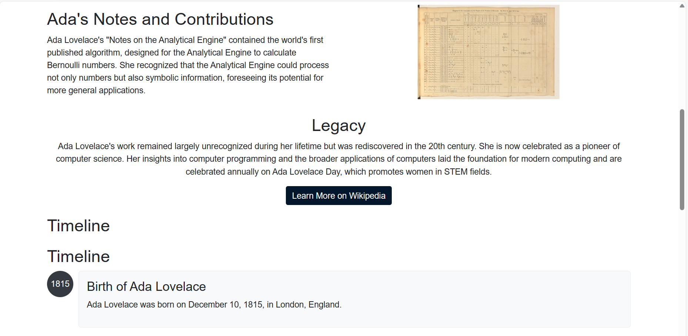
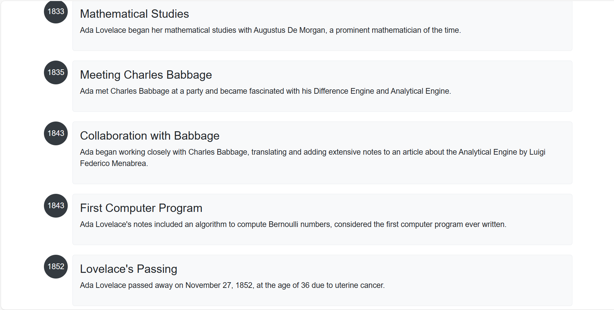

# Tribute Website

**Tribute to Ada Lovelace**

A tribute webpage to celebrate the life and contributions of Ada Lovelace, the world's first computer programmer.

## Table of Contents

- [Description](#description)
- [Technologies Used](#technologies-used)
- [Project Structure](#project-structure)
- [Styling](#styling)
- [How to Use](#how-to-use)
- [outputs].(#Outputs).

## Description

This project is a tribute webpage dedicated to Ada Lovelace, who is recognized as the world's first computer programmer. The webpage provides information about her life, her collaboration with Charles Babbage, and her contributions to the world of computing. It also highlights her legacy and annual celebrations in her honor.

## Technologies Used

- HTML: Used for structuring the webpage.
- CSS: Used for styling the webpage.
- Bootstrap 4.5.2: Used for styling components.
- Images: The project uses images for visual representation.

## Project Structure

- `index.html`: The main HTML file for the webpage.
- `styles.css`: The external stylesheet for styling the webpage.
- `images/`: Directory containing images used in the webpage.

## Styling

The webpage's styling is achieved through CSS, and Bootstrap is used for some components to enhance the visual appeal.

## How to Use

1. Clone the repository to your local machine using Git:

   ```bash
   git clone <https://github.com/sangitaa11/codsoft_1>
2. Open the index.html file in a web browser to view the tribute page.

3. Explore the different sections of the tribute page to learn about Ada Lovelace's life and contributions.

## Project Outputs

-  
- 
- 
- ![Screenshot 4].(output/output4.png).

